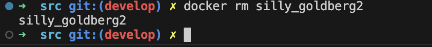

## Part 1. Готовый докер

- ##### Возьмём официальный докер-образ с **nginx** и выкачаем его при помощи `docker pull`.

- ##### Проверим наличие докер-образа через `docker images`.

- ##### Запустим докер-образ через `docker run -d [image_id|repository]`.
- ##### Проверим, что образ запустился через `docker ps`.

- ##### Посмотрим информацию о контейнере через `docker inspect [container_id]` или`docker inspect [container_name]`

 

- ##### Определим размер контейнера, список замапленных портов и ip контейнера.

 Для узнавания размера контейнера Docker с помощью команды docker inspect, можно использовать параметр --size или -s.

- ##### Остановим докер образ через `docker stop [container_id|container_name]`.

- ##### Проверим, что образ остановился через `docker ps`.

- ##### Запустим докер с портами 80 и 443 в контейнере, замапленными на такие же порты на локальной машине, через команду *run*.

- ##### Проверим, что в браузере по адресу *localhost:80* доступна стартовая страница **nginx**.

- ##### Перезапустим докер контейнер через `docker restart [container_id|container_name]`.
- ##### Проверим любым способом, что контейнер запустился.

## Part 2. Операции с контейнером

- ##### Прочитаем конфигурационный файл *nginx.conf* внутри докер контейнера через команду *exec*.

- ##### Создадим на локальной машине файл *nginx.conf*.
с помощью команды `touch` создаем файл.
- ##### Настроим в нем по пути */status* отдачу страницы статуса сервера **nginx**.

- ##### Копируем созданный файл *nginx.conf* внутрь докер-образа через команду `docker cp`.

- ##### Перезапустим **nginx** внутри докер-образа через команду *exec*.

- ##### Проверим, что по адресу *localhost:80/status* отдается страничка со статусом сервера **nginx**.

- ##### Экспортируем контейнер в файл *container.tar* через команду *export*.

- ##### Остановим контейнер.

- ##### Удалим образ через `docker rmi [image_id|repository]`, не удаляя перед этим контейнеры.

 _При использовании команды `rmi` выдается ошибка так как удаление образа невозможно из-за использования образа контейнером. Для удаления в этом случае  используем опцию -f(force) для принудительного выполнения действия, игнорируя предупреждения или запросы подтверждения._
  
- ##### Удалим остановленный контейнер.

- ##### Импортируем контейнер обратно через команду *import*.

  _Для импорта дампа обратно в образ Docker с использованием команды docker import, необходимо использовать опцию `-c 'CMD ["nginx", "-g", "daemon off;"]'`. Она указвает на команду, которая будет выполнена при запуске контейнера на основе нового импортированного образа._

- ##### Запустим импортированный контейнер.

- ##### Проверим, что по адресу *localhost:80/status* отдается страничка со статусом сервера **nginx**.

## Part 3. Мини веб-сервер

- ##### Напишем мини-сервер на **C** и **FastCgi**, который будет возвращать простейшую страничку с надписью `Hello World!`.

- ##### Скачаем новый образ nginx и запустим контейнер с портом 81

- ##### Напишем свой *nginx.conf*, который будет проксировать все запросы с 81 порта на *127.0.0.1:8080*.

 - копируем написанные файлы в контейнер

- ##### Зайдем в контейнер используя комнду
`docker exec -lf [container_id|container_name] bash`
 сделаем `apt-get update` и скачаем компилятор 
 командой `apt install gcc spwn-fcgi libfcgi-dev`

- ##### Скомпилируем и запустим написанный мини-сервер через *spawn-fcgi* на порту 8080.

- ##### Проверим, что в браузере по *localhost:81* отдается написанная страничка.

- ##### Кладём файл *nginx.conf* по пути *./nginx/nginx.conf*.

## Part 4. Свой докер

#### Напиcать свой докер-образ, который:
##### 1) собирает исходники мини сервера на FastCgi из [Части 3]
##### 2) запускает его на 8080 порту;
##### 3) копирует внутрь образа написанный *./nginx/nginx.conf*;
##### 4) запускает **nginx**.

##### - докер-образ

##### - скрипт для запуска

##### Соберем написанный докер-образ через `docker build` указав имя и тег.

##### Проверим через `docker images`, что все собралось корректно.

##### Запустим собранный докер-образ с маппингом 81 порта на 80 на локальной машине и маппингом папки *./nginx* внутрь контейнера по адресу, где лежат конфигурационные файлы **nginx**'а 

 -it: позволяют взаимодействовать с контейнером в интерактивном режиме и присоединить его к текущему терминалу.
 -p 80:81: маппирует порт 81 внутри контейнера на порт 80 хоста
 -v монтирует файл nginx.conf из локальной директории /Users/zekemath/projects/DO5_SimpleDocker-1/src/Part_4/ внутрь контейнера по пути /etc/nginx/nginx.conf.
 -d: запускает контейнер в фоновом режиме

##### Проверим, что по localhost:80 доступна страничка написанного мини сервера.

##### Допишем в *./nginx/nginx.conf* проксирование странички */status*, по которой надо отдавать статус сервера **nginx**.

##### Перезапустим докер-образ.

##### Проверим, что теперь по *localhost:80/status* отдается страничка со статусом **nginx**

## Part 5. **Dockle**

##### Просканируем образ из предыдущего задания через `dockle [image_id|repository]`.

##### Исправим образ так, чтобы при проверке через **dockle** не было ошибок и предупреждений.
##### - Вносим изменения в Докер файле.

##### - Пересобираем образ.

##### - Снова просканируем образ с помощью Dockle.

## Part 6. Базовый **Docker Compose**

##### Напишем файл *docker-compose.yml*, с помощью которого:
##### 1) Поднять докер-контейнер из [Части 5] _(он должен работать в локальной сети, т.е. не нужно использовать инструкцию **EXPOSE** и мапить порты на локальную машину).
##### 2) Поднять докер-контейнер с **nginx**, который будет проксировать все запросы с 8080 порта на 81 порт первого контейнера.

 - services: Определяет список сервисов, каждый из которых может иметь свои настройки.
  Для каждого сервиса вы можете указать:
 - image: Образ, который будет использован для создания контейнера.
 - ports: Определяет проброс портов.
 - build: указание на необходимость сборки из Dockerfile.
 - depends_on: Свойство используется для указания порядка запуска служб.
 - volumes: список томов, которые будут подключены к контейнеру.

##### Остановим все запущенные контейнеры, соберем и запустим проект с помощью команд `docker-compose build` и `docker-compose up`.

##### Проверим, что в браузере по *localhost:80* отдается написанная  страничка, как и ранее.
